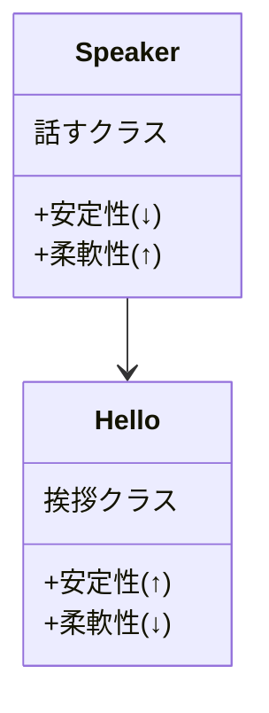

# 依存性逆転の原則

## このリポジトリについて

このリポジトリは、SOLID原則の1つ`依存性逆転の原則(Dependency Inversion Principle)`について、Unityで実践するためにはどのように実装するのかを例にあげて解説しています。

## 依存性逆転の原則の概略

モジュール間で依存関係が成立する場合は、`依存する側は安定性が低く`、`柔軟性が高く`なります。これはモジュールをimportするほど、コードが複雑になるからです。一方で、依存される側は安定性が高く、柔軟性は低くなります。

以下の例では、`Speakerクラス`は話すことはできるが、挨拶の仕方は知らないので、挨拶が必要な時は`Helloクラス`から挨拶の言葉を教えてもらいます。教えてもらうということは、依存する必要があるので、`Speakerクラス`は`Helloクラス`に依存しているということになります。



## 例 : ゲームの船を操作する機能を作成する

以下のコードは、`アタッチしたオブジェクト`に対して、入力された量の回転と移動を行うコードです。

```c#
using UnityEngine;

public class ShipMeterOriginal : MonoBehaviour {
    [SerializeField] private float turnSpeed = 15f;
    [SerializeField] private float moveSpeed = 10f;

    private void Update() {
        //  入力の受け取りが、Inputクラスに依存している
        //  ユーザーの入力しか受け付けない
        float rotation = Input.GetAxis("Horizontal");
        float thrust = Input.GetAxis("Vertical");

        //  回転
        transform.Rotate(Vector3.up * rotation * Time.deltaTime * turnSpeed);
        //  前進
        transform.position += transform.forward * thrust * Time.deltaTime * moveSpeed;
    }
}
```

このコードには、以下の問題があります。

- 入力処理と移動処理が1つのスクリプトに入っている
  - 単一責任原則に違反している

- パラメーターの設定が1種類しかできない
  - 別のパターンの船の動きを作りたい場合に、既存の値を上書きすることになる

- 入力がキーボードからの入力にしか対応していない(キーボードからの入力に依存している)
  - 入力に対する柔軟性が低く、依存性が高い

## 改善策

### 1. 単一責任原則を守る

`移動`と`入力`にスクリプトを分割する

- ShipMotor(移動)

  ```c#
  using UnityEngine;

  /// <summary>
  /// 船の移動
  /// </summary>
  [RequireComponent(typeof(ShipInput))]
  public class ShipMotor : MonoBehaviour
  {
      [SerializeField] private float turnSpeed = 15f;
      [SerializeField] private float moveSpeed = 10f;

      private ShipInput _shipInput;

      private void Awake() {
          _shipInput = GetComponent<ShipInput>();
      }

      private void Update() {
          float rotation = _shipInput.Rotation;
          float thrust = _shipInput.Thrust;

          //  回転
          transform.Rotate(Vector3.up * rotation * Time.deltaTime * turnSpeed);
          //  前進
          transform.position += transform.forward * thrust * Time.deltaTime * moveSpeed;
      }
  }

  ```

- ShipInput(入力)

  ```c#
  using UnityEngine;

  /// <summary>
  /// 船への入力
  /// </summary>
  public class ShipInput : MonoBehaviour
  {
      public float Rotation { get; private set; }
      public float Thrust { get; private set; }

      private void Update() {
          Rotation = Input.GetAxis("Horizontal");
          Thrust = Input.GetAxis("Vertical");
      }
  }
  ```

これで、ある程度、単一責任原則を守ることができました。

### 2. パラメーターの設定が1種類しかできない

この問題を解決するために、Unityでは`ScriptableObject`を使用することで対応しています。

この`ScriptableObject`を使用して各種設定項目を、簡単に切り替えられるようにしておくことで、設定の切り替えが簡単になります。

- ShipSettings : 設定ファイル

  ```c#
  using UnityEngine;

  /// <summary>
  /// 船のパラメーターの設定
  /// </summary>
  [CreateAssetMenu(menuName = "Ship/Settings", fileName = "ShipData")]
  public class ShipSettings : ScriptableObject {
      [SerializeField] private float _turnSpeed = 25f;
      [SerializeField] private float _moveSpeed = 10f;
      [SerializeField] private bool _useAi = false;

      public float TurnSpeed { get { return _turnSpeed; } }
      public float MoveSpeed { get { return _moveSpeed; } }
  }
  ```

- ShipInput : 1つ前で分割したインプットを修正

  ```c#
  using UnityEngine;

      /// <summary>
      /// 船の移動
      /// </summary>
      [RequireComponent(typeof(ShipInput))]
      public class ShipMotor : MonoBehaviour {

          //  設定ファイル(ScriptableObject)を使用
          [SerializeField] private ShipSettings setting;

          private ShipInput _shipInput;

          private void Awake() {
              _shipInput = GetComponent<ShipInput>();
          }

          private void Update() {
              float rotation = _shipInput.Rotation;
              float thrust = _shipInput.Thrust;

              //  回転
              transform.Rotate(Vector3.up * rotation * Time.deltaTime * setting.TurnSpeed);
              //  前進
              transform.position += transform.forward * thrust * Time.deltaTime * setting.TurnSpeed;

          }
      }
  ```

### 3. 入力がキーボードからの入力にしか対応していない(キーボードからの入力に依存している)

今の実装では、ユーザーからの入力しか対応していない状態です。このままでは、AIに船を動かせるようにしたり、ネットワーク経由で動かせるようにしたい場合に、`ShipInput`に条件分岐を追加する必要があったり、処理を書き換える必要が出てきます。

- コードがこうなってしまう

  ```c#
  using UnityEngine;

  /// <summary>
  /// 船への入力
  /// </summary>
  public class ShipInput : MonoBehaviour
  {
      public float Rotation { get; private set; }
      public float Thrust { get; private set; }

      public bool UseController;
      public bool UseAi;
      public bool UseNetwork;

      private void Update() {
        if(UseController){
          Rotation = Input.GetAxis("Horizontal");
          Thrust = Input.GetAxis("Vertical");
        }else if(UseAi){
          //  AIに操作させる
        }else if(UseNetwork){
          //  ネットワーク経由で操作する場合
        }
      }
  }
  ```

if文を追加する必要が出てくる場合は、SOLID原則の中の`OpenClosedの原則`に違反していることが多いです。

この原因は、ShipInputが入力の詳細について知りすぎていることにあります。

船への入力として`ShipInput`が知りたいことは、外部から必要とされている`Rotation`と`Thrust`の値になります。この時に、ShipInputは`どのように入力されてその値が取得できるか`を知る必要はありません。

よって、値の出どころの処理は別のクラスに分離して、受け取った値を渡すことに専念します。

### 入力タイプの分離

依存性逆転の原則も使い、`ShipInput`クラスの安定性を上げる

- 入力ソースに対応した`XXXInput`クラスを作り、インターフェイスを通してやり取りを行う。こうすることで、`ShipInput`が`依存する側`から`依存される側`にすることができる
  - これは、見方の問題で、`IShipInput`は`ShipInput`の一部としてみることで、`XXXInputクラス`たちが`IShipInputに依存している`、イコール`ShipInput`に依存しているという解釈にしている

- インターフェイスを通さない状態

  ```mermaid
  classDiagram

  class ShipInput{
    船への入力データを管轄するクラス
  }

  class AIInput{
    AI入力ソースクラス
  }

  class ControllerInput{
    ユーザー入力ソースクラス
  }

  class NetworkInput{
    ネットワーク入力ソースクラス
  }

  ShipInput ..> AIInput
  ShipInput ..> ControllerInput
  ShipInput ..> NetworkInput
  ```

- インターフェイスを通す状態

  ```mermaid
  classDiagram

  class ShipInput{
    船への入力データを管轄するクラス
  }

  class AIInput{
    AI入力ソースクラス
  }

  class ControllerInput{
    ユーザー入力ソースクラス
  }

  class NetworkInput{
    ネットワーク入力ソースクラス
  }

  ShipInput ..> IShipInput 
  IShipInput <|.. AIInput
  IShipInput <|.. ControllerInput
  IShipInput <|.. NetworkInput
  ```

### XXXInputの生成の責任を分離

単純に入力クラスを作るだけでは、`ShipInput`が生成時に以下のように条件分岐を持ってしまう

  ```c#
  public class ShipInput : MonoBehaviour
  {
    //  省略

    private IShipInput _input;

    public bool UseController;
    public bool UseAi;
    public bool UseNetwork;

    private void Start(){
      //  結局ここで状態判別処理が入ってくる
      if(UseAi){
        _input = new AiInput();
      }else if(UseController){
        _input = new ControllerInput();
      }else if(UseNetwork){
        _input = new NetworkInput();
      }
    }

    private void Update() {
         = _input.GetInput();
    }
  }
  ```
  
  - これでは、`インスタンス生成の適切な生成という責任をShipInputが持ってしまう`ので、インスタンス生成クラス(Factory)を使用して、責任を分離する

    ```c#
    public enum ShipInputType {
        AI,
        Controller,
        Network,
    }

    public class ShipInputFactory : IInputFactory {
        public IShipInput Create(ShipInputType type) {
            switch (type) {
                case ShipInputType.AI: {
                        return new AiInput();
                    }
                case ShipInputType.Controller: {
                        return new ControllerInput();
                    }
                case ShipInputType.Network: {
                        return new NetworkInput();
                    }
            }

            return null;
        }
    }
    ```

これで、以下のコードのように、ShipInputは自身の責任(`どの数値が入力されたのか`)だけに責任を持てるようになります。

### 入力関係のクラスとインターフェイスの例

- IShipInput(インターフェイス)
  - このインターフェイスを実装することで船への入力方法を持っているクラスを作れる

    ```c#
    public interface IShipInput {
        void ReadInput();
        float Rotation { get; }
        float Thrust { get; }
    }
    ```

- AiInput(クラス)
  - IShipInputインターフェイスを実装して、AIの入力ロジックを記述する

    ```c#
    using UnityEngine;

    public class AiInput : IShipInput {
        public float Rotation { get; private set; }

        public float Thrust { get; private set; }

        public void ReadInput() {
            Rotation = Random.Range(-1f, 1f);
            Thrust = Random.Range(-1f, 1f);
        }
    }
    ```

- ControllerInput(クラス)
  - IShipInputインターフェイスを実装して、ユーザーの入力ロジックを記述する

    ```c#
    using UnityEngine;

    public class ControllerInput : IShipInput {
        public float Rotation { get; private set; }

        public float Thrust { get; private set; }

        public void ReadInput() {
            Rotation = Input.GetAxis("Horizontal");
            Thrust = Input.GetAxis("Vertical");
        }
    }
    ```
